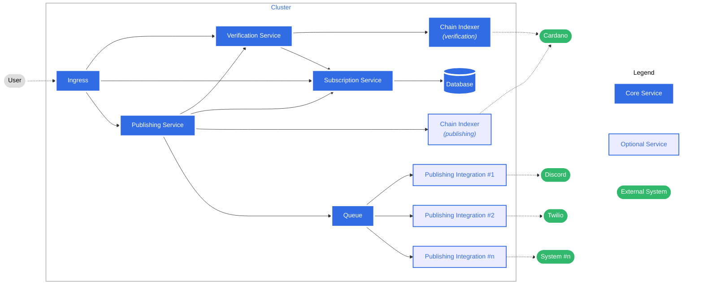

# Basic Architecture Diagram

## 💡 Purpose

This article outlines the initial architectural design of the "Reach Your People" application. It will be adjusted as the architecture evolves and as we find functional and non-functional requirements and create ADRs for the specifics of each service.

## 🖼️ Diagram

## 📓 Glossary

### User
The end user/client accessing the application, which includes both publishers and subscribers.

### Ingress
A cluster ingress that ensure the requests coming from the outside world are routed correctly to the respective services. In the initial design, all incoming user-driven traffic will go through HTTP/HTTPS.

### Subscription Service
The subscription service tracks which users/wallets have subscribed (or explicitly unsubscribed) from which message types, projects etc. It allows the publishing service to access this information when something is announced, and the end user to change their subscription preferences.

### Verification Service
The verification services allows publishers and subscribers to verify their project or wallet ownership. Depending on the type, different verification mechanisms will be supported. It is possible that multiple verification services will be developed instead of just one. This is to be determined as the complexity of the different verifications (wallet vs. SPO vs DIDs) is evaluated. The verification service will delegate some persistence storage to the subscription service (for example a verified wallet can be linked to one or more social account).

### Publishing Service
The publishing service is where verified publishers can send announcements. The service will check publishing permissions for the submitting entity. Following successful validation, it will access the subscription service to determine eligible recipients and message types to distribute and provide them to a queue for further processing.

### Chain Indexer (verification)
A chain indexing solution for Cardano that is suitable for accessing the information required to verify wallets, DIDs etc. Multiple indexers may be required, depending on the implementation.

### Chain Indexer (publishing)
If a supported publishing method is through on-chain metadata (to be determined), an optional chain indexing solution for Cardano that can ingest publishing requests may be added to the application.

### Database
A database solution (relational, document-based, or other) that stores the subscription preferences and maps wallets of subscribers to their verified social media and messaging accounts. In the future, some or all of that information can be stored on-chain and make the solution more decentralized. For this however to safely happen, a privacy-preserving blockchain needs to be available or encryption-mechanisms used, which is out of scope of the initial prototype.

### Queue
Any queuing solution that allows persistent storage of messages that should be processed can be used. There are no strict requirements for ordering or performance at this time.

### Publishing Integration #n
The publishing integrations are the different systems that will be built to bring the published messages to the end users. They read messages from the publishing queue and are solely responsible for the delivery. When messages reach the integration, all decisions with regards to eligibility and verification should have been made, and only integration-related issues should prevent the delivery (for example rejecting direct messages from the corresponding Discord bot or blocked email addresses).

### Cardano, Discord, Twilio, etc...
These external systems already exist and are connected to either as read, read-write or write-only systems.

## 📝 Notes

### Performance
The initial architecture does not include caching services and other performance optimizations beyond the standards expected for the respective systems (e.g. proper indexes for a relational database).

### Service Discovery
We will investigate if a service-discovery based solution can make creating new integrations even more decoupled from the core services. With the initial proposal, core services have to know about all existing integrations to properly give them access to the correct data. A service discovery solution would notably change the architecture diagram and will be further evaluated during the lifecycle of the development. In this case, new integrations would register with a service registry. This solution would mean some of the app-specific verification, subscription and publishing capabilities code would live in the integration, instead of just the core modules.