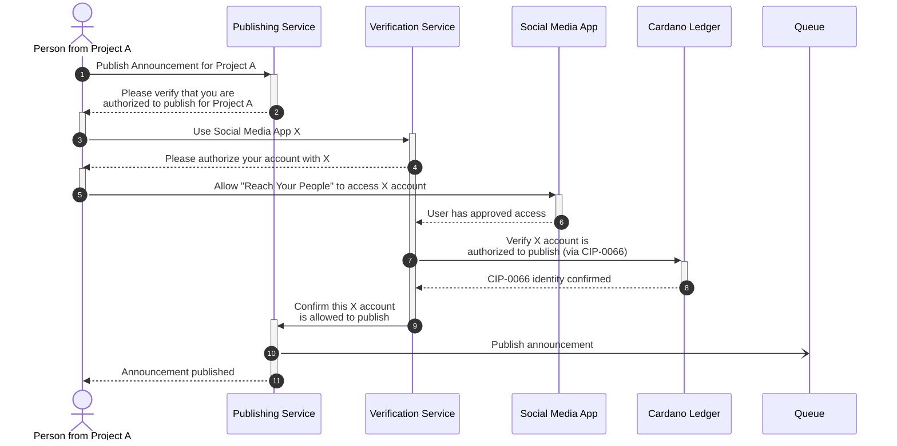

# Publishing Sequence Diagrams

## Publishing for a Project

### 💡 Purpose
This diagram showcases the basic flow of events when a person that manages a project wants to publish an announcement. In this example, the users authorization is verified by means of connecting a social media account for the platform X (formerly Twitter), which is confirmed to be the official account for the project via [CIP-0066](https://github.com/cardano-foundation/CIPs/pull/294) on-chain.

This diagram focuses on the successful flow and does not model any error conditions.

### ⚠️ Assumptions
The person is completely new to the service and has not previously verified that they have permissions to publish on behalf of the project.

### 🖼️ Diagram

