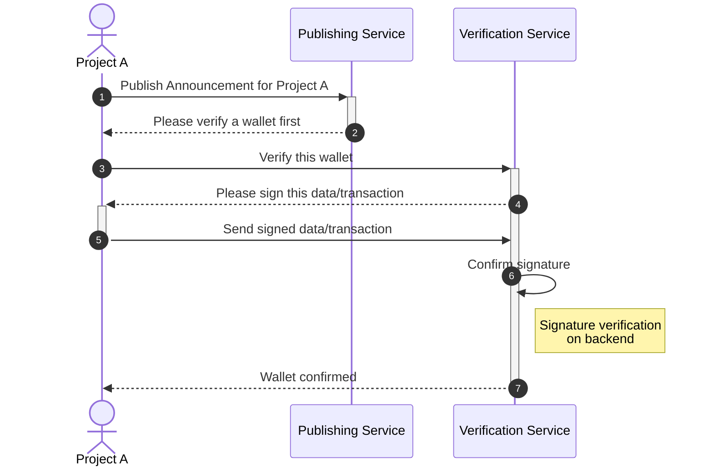

# Publishing Sequence Diagram

## 💡 Purpose
This diagram showcases the basic flow of events when a project wants to publish an announcement.

## 🖼️ Diagram

```mermaid
sequenceDiagram
    autonumber
    actor P as Project A
    participant PUB as Publishing Service
    participant V as Verification Service
    P ->> +PUB: Publish Announcement for Project A
    PUB -->> -P: Please verify a wallet first
    P ->> +V: Verify this wallet
    V -->> +P: Please sign this data/transaction
    P ->> -V: Send signed data/transaction
    V ->> V: Confirm signature
    Note right of V: Signature verification<br>on backend
    V -->> -P: Wallet confirmed
```
