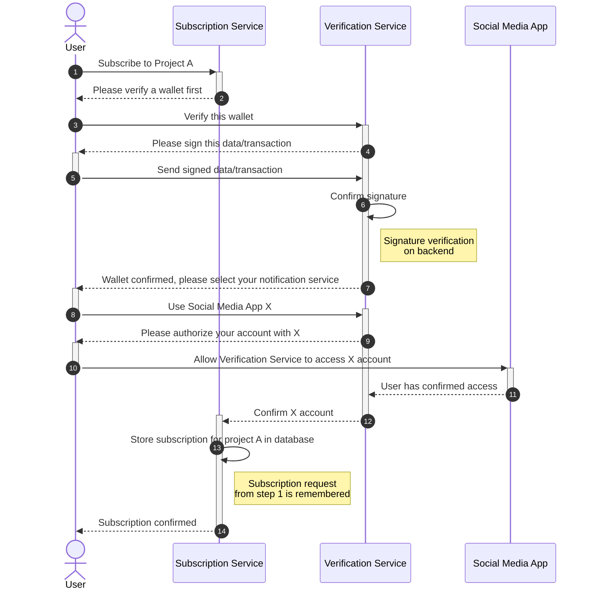

# Subscription Sequence Diagram

## 💡 Purpose
This shows sequence of events that occurs when a new user wants to subscribe to a project named A, using notifications through a social media account at X.

### Assumptions
The user is completely new to the service and has no previous verified wallets and not yet authorized the RYP application to interact with the social media app.

## 🖼️ Diagram

### Wallet Verification and Social Media Authentication Sequence

