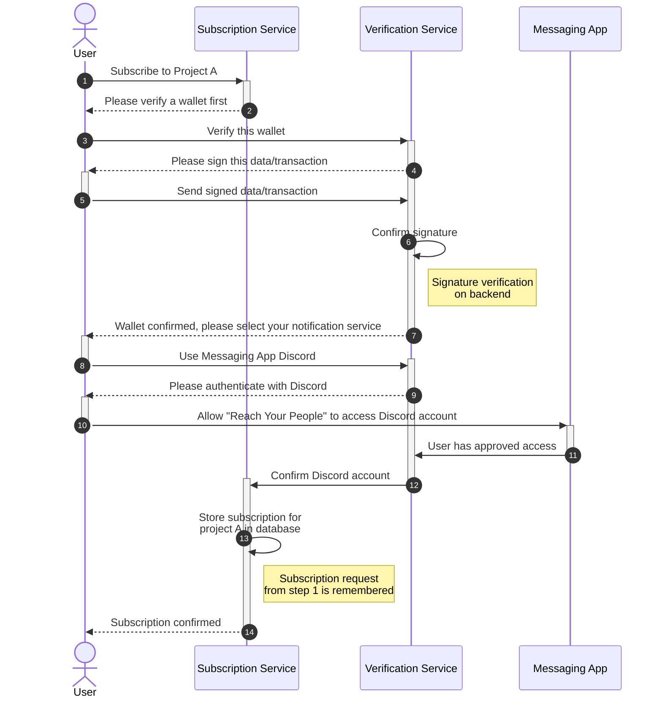

# Subscription Sequence Diagrams

## Wallet Verification and Social Media/Messaging Authorization

### 💡 Purpose
This shows the sequence of events that occurs when a new user wants to subscribe to a project named A, using notifications through a messaging account on Discord. This diagram focuses on the successful flow and does not model any error conditions.

### ⚠️ Assumptions
The user is completely new to the service and has no previous verified wallets and not yet authorized the RYP (Reach Your People) application to interact with the messaging app.

### 🖼️ Diagram

### 🔗 SVG Link
[/docs/diagrams/user-subscription-sequence-01.svg](./user-subscription-sequence-01.svg)