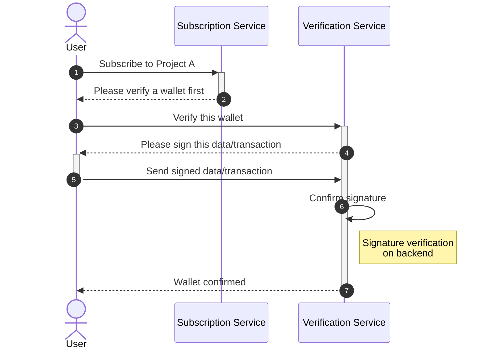
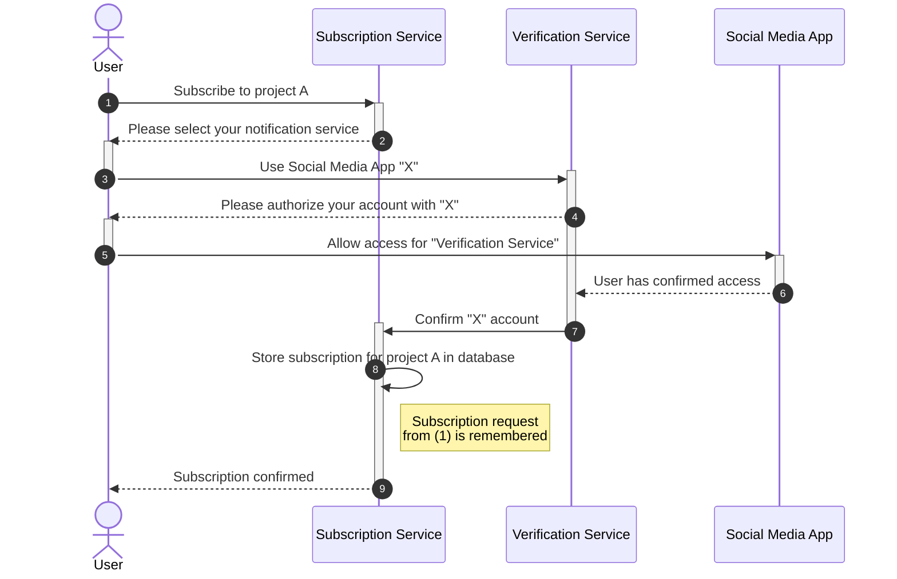

# Subscription Sequence Diagram

## 💡 Purpose
These two diagrams lay out the sequence of events for what happens when a new user would like to subscribe to a project named "A", using a social media account at "X". To reduce the complexity of the sequence diagram, the process has been split into two parts:

1. Verification of the wallet
2. Verification of X account

### Assumptions
The user is completely new to the service and has no previous verified wallets.

## 🖼️ Diagrams

### Wallet Verification Sequence

### Social Media Authentication Sequence

