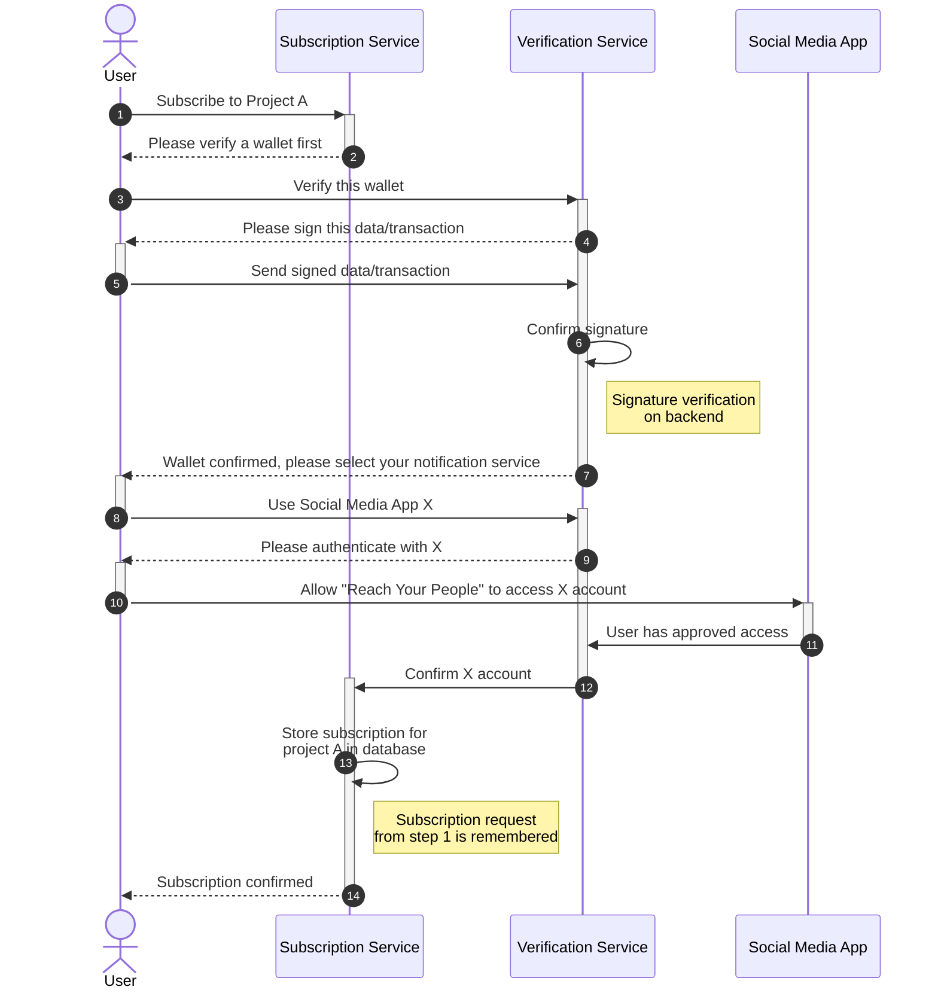

# Subscription Sequence Diagrams

## Wallet Verification and Social Media Authorization

### 💡 Purpose
This shows the sequence of events that occurs when a new user wants to subscribe to a project named A, using notifications through a social media account at X (formerly Twitter). This diagram focuses on the successful flow and does not model any error conditions.

### ⚠️ Assumptions
The user is completely new to the service and has no previous verified wallets and not yet authorized the RYP (Reach Your People) application to interact with the social media app.

### 🖼️ Diagram

### 🔗 SVG Link
[/docs/diagrams/user-subscription-sequence-01.svg](./user-subscription-sequence-01.svg)